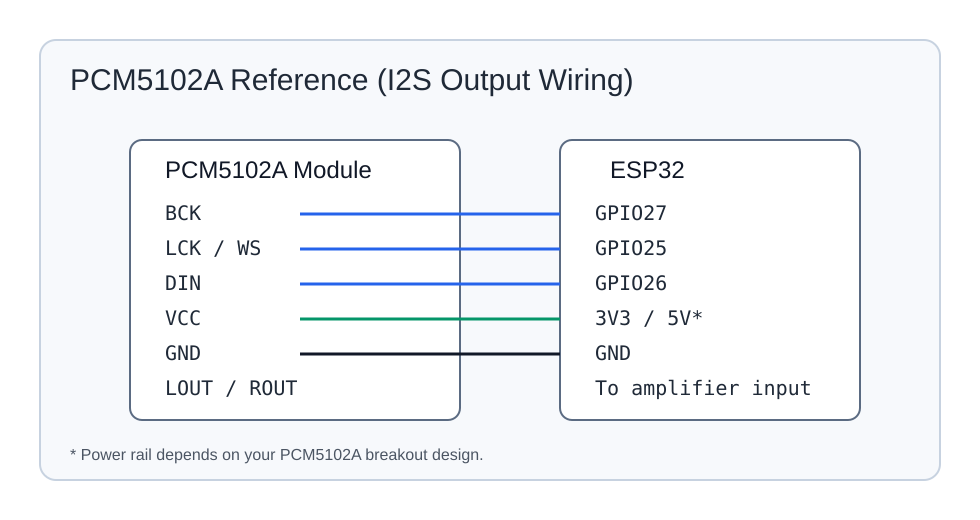

# ESP-NOW Audio Sink (ESP32 + PCM5102A)

This project receives ADPCM audio packets over ESP-NOW, decodes them to PCM, then outputs stereo audio over I2S to a PCM5102A DAC.

The code that is currently built is `main/main_adpcm.c`.

## Target and Required Environment

- MCU target: **ESP32**
- ESP-IDF version: **5.5.2**
- Transport: **ESP-NOW broadcast receiver**
- Audio format on air: **IMA ADPCM** (must match source)

## Hardware

### Sink board
- ESP32 dev board
- PCM5102A DAC module

### PCM5102A reference image



## Wiring (ESP32 -> PCM5102A)

Configured in `main/main_adpcm.c`:

- `GPIO27` -> `BCK`
- `GPIO25` -> `LCK / WS`
- `GPIO26` -> `DIN`
- `GND`    -> `GND`
- `3V3/5V` -> module power (follow your PCM5102A module spec)

## Runtime Parameters (current code)

- Wi-Fi channel: `11`
- ADPCM payload: up to `96` bytes
- Frame size: `96` stereo sample-pairs
- Sample rate: `48 kHz`, stereo
- Low-latency ring buffer + PLC replay logic

## Build and Flash (ESP-IDF 5.5.2)

```bash
idf.py --version
```

Confirm this shows `ESP-IDF v5.5.2`.

```bash
idf.py set-target esp32
idf.py build
idf.py -p COMx flash monitor
```

Replace `COMx` with your board port.

## Source/Sink Match Rules

These values must match source firmware:

- Wi-Fi channel
- ADPCM packet format (header + payload assumptions)
- sample rate and frame size

If one side changes packet layout, update both repos together.

## Notes on Logging

Serial output is focused on operations, not noise:

- receive rate and playback rate
- queue depth and underruns
- adaptive latency controls and sync drift

This makes it easier to tune stability while keeping latency low.
